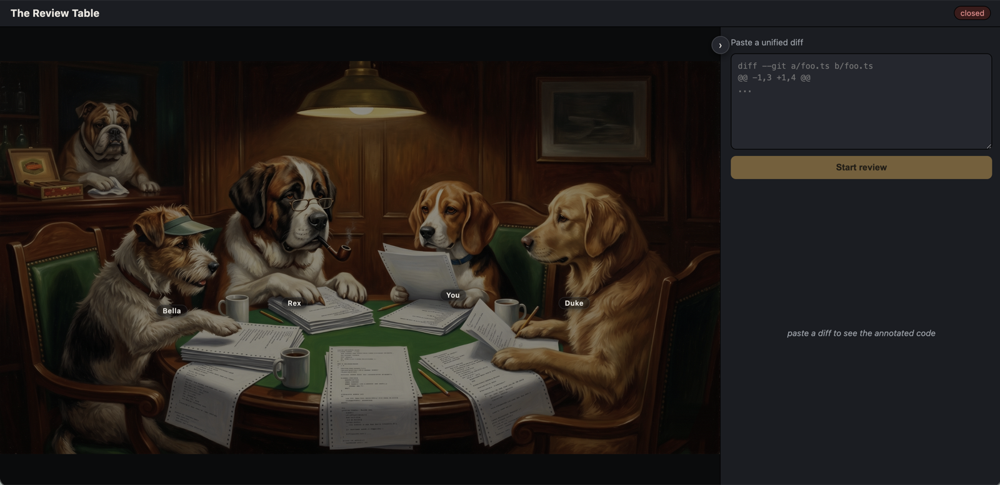

# The Review Table

A live, voiced, multi-party **code review staged as the "dogs playing poker" painting.**
Three AI reviewer dogs — Rex, Bella, and Duke — argue about your pull request *with each
other*, out loud, while an invisible **director** decides who speaks and when. You (the
beagle) join by typing or push-to-talk. At the end, the table delivers a verdict.

It's a demo of an idea: a code review that feels like a room of opinionated colleagues
rather than a list of inline comments.

> Status: working MVP. Runs end-to-end with or without API keys.



## How it works

- A **director** LLM emits a structured *move* each turn (who speaks, what they should do,
  which lines they're about). A separate **speaker** call turns that move into one dog's
  in-character line — so each dog keeps its own voice. Two calls per turn, always.
- Dogs reference code through opaque **anchor ids** resolved by a single resolver; raw line
  numbers never leak into prompts or dialogue. The cited lines highlight in the diff pane.
- Dogs speak via **text-to-speech**; an active-speaker **spotlight** swings across the
  fixed scene image, with name labels and streaming captions.
- You can be **given the floor** by the director, or **raise a paw** to interject — which
  stops the speaking dog and hands you the mic (dog audio is hard-paused while you talk).
- A **1-turn lookahead pipeline** generates the next turn while the current one plays, so
  the gaps between dogs stay short.

The design is contract-first and provider-agnostic: LLM / TTS / STT all sit behind
adapters, and the orchestration core doesn't know which provider is wired.

## Quick start

Requires Node ≥ 20 and [pnpm](https://pnpm.io).

```bash
pnpm install
pnpm dev
```

`pnpm dev` starts the server and the Vite client on auto-picked free ports and prints a
local URL. Open it, paste a unified diff (there's one in `fixtures/sample.diff`), and click
**Start review**.

### Running without keys (default)

With no API keys, the app runs on **deterministic fakes** — a scripted review, buzzy
placeholder voices (real WAV, so lip-sync/spotlight still work), and a canned STT result.
The entire turn loop, audio pipeline, and human-in-the-loop paths run with zero network and
zero cost. This is the default whenever keys are missing, or you can force it with
`USE_FAKES=1`.

### Running with real voices

Copy the template and add your keys (server-side only — the browser never receives them):

```bash
cp apps/server/.env.example apps/server/.env
# edit apps/server/.env:
#   ANTHROPIC_API_KEY=...
#   ELEVENLABS_API_KEY=...
```

Restart `pnpm dev`. The boot log prints `providers: real` when both keys are present.

### Useful knobs (all optional, in `apps/server/.env`)

- `DIRECTOR_MODEL` — run the director on a faster/cheaper model (it only emits a structured
  move), e.g. `claude-haiku-4-5-20251001`, to shrink the between-turns gap.
- `VOICE_REX` / `VOICE_BELLA` / `VOICE_DUKE` — ElevenLabs voice ids per dog.
- Spotlight/dimming intensity is tunable via CSS variables at the top of
  `apps/client/src/styles.css`.

## Layout

```
packages/contracts/   # shared wire/format types — the source of truth, imported both sides
packages/anchoring/   # unified-diff parser + anchor resolver + validation (unit-tested)
apps/server/          # Node + ws: director loop, adapters, ledger, session state
apps/client/          # React + Vite: scene, diff pane, audio/lip-sync, human input
fixtures/             # a standing sample diff
docs/                 # architecture notes + the scene image
```

## Docs

- [`docs/ARCHITECTURE.md`](docs/ARCHITECTURE.md) — the turn loop, floor control, audio/lip-sync, anchoring
- [`docs/EVAL.md`](docs/EVAL.md) — the eval harness: what it measures (recall) and why precision isn't scored
- [`packages/contracts/src`](packages/contracts/src) — the authoritative wire/format schemas and interfaces, in code

## Tests

```bash
pnpm -r typecheck                                      # all packages
pnpm -r test                                           # unit tests (anchoring + server, 51)
pnpm --filter @review-table/server smoke               # keyless end-to-end smoke
```

Unit tests cover the anchoring/diff logic (`packages/anchoring`) and the server's ledger
rules, anti-agreeableness gate, and addressing logic (`apps/server/test`). The full turn
loop and the human-interject path are exercised by the keyless `smoke` script. The client
is verified by typecheck + manual browser passes.

## Evals

```bash
pnpm eval                         # score from cached transcripts (free, no API calls)
pnpm eval -- --fresh --label="…"  # re-run the review live (needs ANTHROPIC_API_KEY; costs money)
pnpm eval:check                   # validate the ground-truth fixtures
```

The eval drives the real multi-dog review over a labeled set of diffs in `fixtures/eval/`
and measures **catch-rate (recall)** — did the dogs surface the planted bugs? Recall is the
scored metric; extra (non-ground-truth) findings are tracked descriptively, not graded — see
[`docs/EVAL.md`](docs/EVAL.md) for the reasoning. Results land in `EVAL-REPORT.md` (latest run,
gitignored) and the running baseline→change narrative [`EVAL-LOG.md`](EVAL-LOG.md).

## Credits

The scene is a Gemini-generated take on C. M. Coolidge's *A Friend in Need* ("Dogs Playing
Poker"); the original composition is US public domain.
